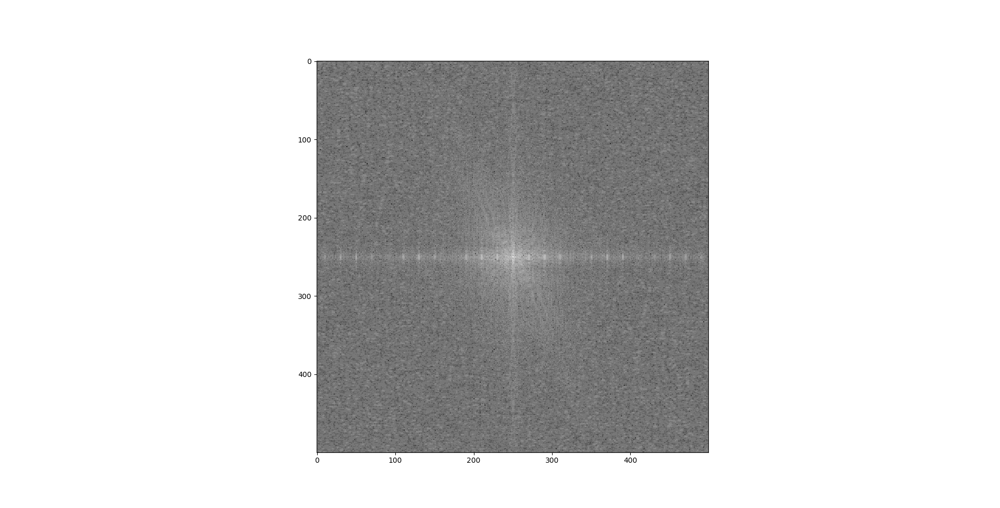
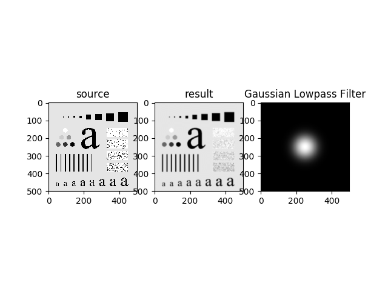
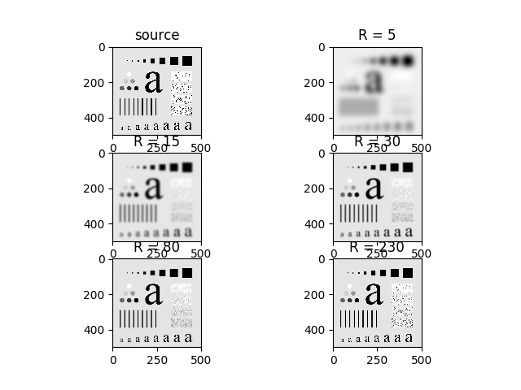
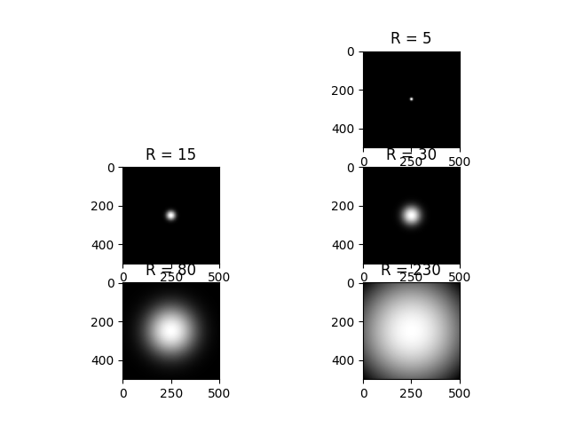
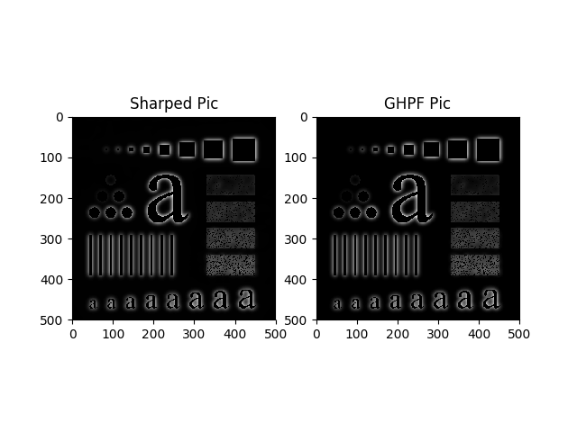
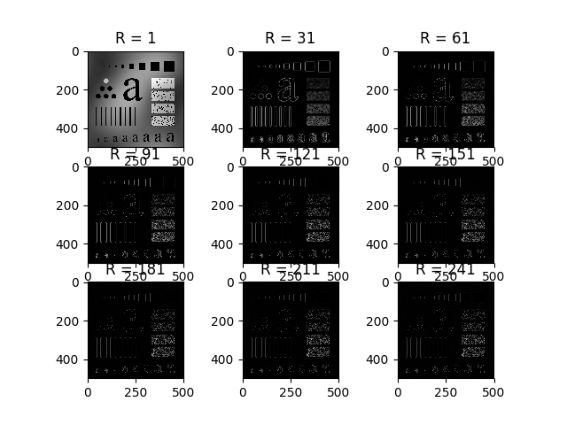
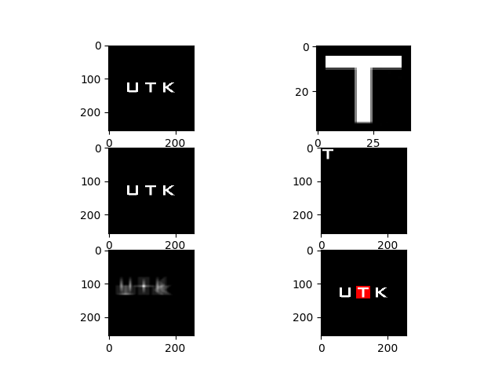
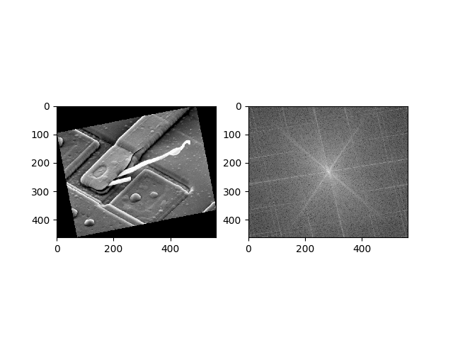

# 数字图像处理 实验二
姓名: 吴侃
学号: 14348134
邮箱: wkcn@live.cn
***
摘要:
本次实验中, 我实现了纯矩阵乘法的离散傅里叶正变换与反变换, 图像的中心化, 频谱的计算与显示, 平均值的计算, 低通滤波器和高通滤波器的实现, 两张图像相关系数的计算, 以及探究了旋转图像下频谱与图像的关系.
***
实验环境:
编程语言: python 2.7
第三方库: numpy, scipy, matplotlib
***
## 04-01 Two-Dimensioal Fast Fourier Transform
### 问题内容
	(a) Multiply the input image by (-1)^(x+y) to center the transform for filtering.

	(b) Multiply the resulting (complex) array by a real function (in the sense that the real coefficients multiply both the real and imaginary parts of the transforms).

	    Recall that multiplication of two images is done on pairs of corresponding elements.

	(c) Compute the inverse Fourier transform.

	(d) Multiply the result by (-1)^(x+y) and take the real part.

	(e) Compute the spectrum.

### 技术讨论
- 中心化
	经过中心化后, 图像的频谱图的直流分量值将移到中心.
	$$f(x,y)(-1)^{(x+y)} <-> F(u-M/2,v-N/2)$$
- 二维正傅里叶变换
	将图像从空间域转到频域
	$$F(u,v)=\frac{1}{MN}\sum_{x=0}^{M-1}\sum_{y=0}^{N-1}f(x,y)e^{-2j\pi(ux/M+vy/N)}$$
- 二维逆傅里叶变换
	将图像从频域转到空间域
	$$f(x,y)=\sum_{u=0}^{M-1}\sum_{v=0}^{N-1}F(u,v)e^{2j\pi(ux/M+vy/N)}$$
- 空间域的卷积 <-> 频域的乘积
    $$f(x,y) * g(x,y) <-> F(u,v)G(u,v)$$
### 结果分析
* 对图像进行傅里叶变换, 使图像从空间域转为频域.
* 假设图像在空间域的大小为MxN, 该图像经过傅里叶变换, 从空间域到频域后, 在频域中的最小大小也为MxN, 周期为MxN.
* 这里使用三个矩阵相乘的方法实现离散傅里叶变换(DFT)
* 使用了numpy自带的fft2, octave和matlab的fft2, 和自己实现的DFT函数进行比较. 发现fft2得到的结果没有乘以系数1/MN
公式推导:
	$$F(u,v)=\frac{1}{MN}\sum_{x=0}^{M-1}\sum_{y=0}^{N-1}f(x,y)e^{-2j\pi(ux/M+vy/N)}$$
    $$      =\frac{1}{MN}\sum_{x=0}^{M-1}[{\sum_{y=0}^{N-1}f(x,y)e^{-2j\pi(vy/N)}]e^{-2j\pi(ux/M)}}$$
矩阵化后的实现代码:
```
def DFT2(im):
    row, col = im.shape
    # 由于周期性
    rs = np.matrix(np.arange(row))
    ur = np.multiply(rs.T, rs)
    cs = np.matrix(np.arange(col))
    uc = np.multiply(cs.T, cs)

    left = np.exp(-2j * np.pi * ur / row)
    right = np.exp(-2j * np.pi * uc / col)

    return left * im.astype(np.complex) * right / (row * col)

```
逆傅里叶变换的实现方法同理.
## 04-02 Fourier Spectrum and Average Value
### 问题内容
	(a) Download Fig. 4.18(a) and compute its (centered) Fourier spectrum.

	(b) Display the spectrum.

	(c) Use your result in (a) to compute the average value of the image.
### 技术讨论
- 显示频谱

	由于图像矩阵经过傅里叶变换后得到的二维矩阵的元素为虚数, 并且存在负数和绝对值比较大的数. 为了得到良好的显示效果, 将傅里叶变换后得到的结果F(u, v), 转换为$$\log_2(1 + abs(F(u, v)))$$

- 计算均值
	- 当进行傅里叶变换前没有将图像中心化时, 当u = 0, v = 0, F(0, 0)等于图像像素取值的平均值.
		$$F(0,0)=\frac{1}{MN}\sum_{x=0}^{M-1}\sum_{y=0}^{N-1}f(x,y)$$
	- 当进行傅里叶变换前进行了图像中心化时, 若M, N都为偶数时, u = M / 2, v = N / 2时, F(u, v)等于图像像素取值的平均值.
	$$f(x,y)(-1)^{(x+y)} <-> F(u-M/2,v-N/2)$$
	u = M/2, v = N/2 时, F(u-M/2,v-N/2) = F(0,0)

	 [注: 这里的矩阵下标从0开始]

### 结果分析
使用了自己编写的DFT函数和numpy自带的fft2函数, 针对中心化和非中心化分别求图像像素取值的平均值. 发现四种方法的结果一致.
```
The average value is 207.36348 (center, fft2)
The average value is 207.36348 (no center, fft2)
The average value is 207.36348 (center, dft2)
The average value is 207.36348 (no center, dft2)
```


图像的中心点最亮, 由于傅里叶变换前进行了中心化, 频谱图的中心为直流分量的取值.

频谱图的横轴和纵轴比较亮, 在横轴上能够看到很多个亮点, 说明图像的频谱在横轴的频率比较高.  

## 04-03 Lowpass Filtering
### 问题内容
	(a) Implement the Gaussian lowpass filter in Eq. (4.3-7). You must be able to specify the size, M x N, of the resulting 2D function. 

		In addition, you must be able to specify where the 2D location of the center of the Gaussian function.

	(b) Download Fig. 4.11(a) [this image is the same as Fig. 4.18(a)] and lowpass filter it to obtain Fig. 4.18(c).
### 技术讨论
- 高斯低通滤波器
$$H(u,v)=e^{-D^2(u,v)}/(2D_0^2)$$
$$D(u,v)=\sqrt{(u - M/2)^2 + (v - N/2) ^2}$$
### 结果分析


上图中, 左图为原图, 中间图为经过高斯低通滤波器后得到的图, 右图为高斯低通滤波器.



更改高斯低通滤波器的半径(方差, D0), 可以发现高斯低通滤波器的半径越小, 图像越模糊, 图像的细节越不清晰.



上图显示了不同半径的高斯低通滤波器的频谱图, 白色区域为滤波器允许通过的频率, 允许通过的频率为低频率.

半径越大, 白色区域的面积越大, 通过的频率的范围就越广, 能允许更高的频率通过. 

## 04-04 Highpass Filtering Using a Lowpass Image
### 问题内容
	(a) Subtract your image in Project 04-03(b) from the original to obtain a sharpened image, as in Eq. (4.4-14). You will note that the resulting image does not resemble the Gaussian highpass results in Fig. 4.26. Explain why this is so.

	(b) Adjust the variance of your Gaussian lowpass filter until the result obtained by image subtraction looks similar to Fig. 4.26(c). Explain your result.
### 技术讨论
	- 锐化图像
	原图与其进行低通滤波得到的图像进行相减, 得到锐化图像.
	
$$sharped_pic = source_pic - blur_pic$$
	
	- 高斯高通滤波器
	高通滤波器在频域内的函数等于1减去其对应的低通滤波器在频域内的函数

$$H_{HP} = 1 - H_{LP}$$
$$H(u,v)=e^{-D^2(u,v)}/(2D_0^2)$$

    所以高斯高通滤波器:
    
$$GHPF(u,v)=1 - e^{-D^2(u,v)}/(2D_0^2)$$

### 结果分析


	观看结果图像, 两张图像的底色都为黑色.
	
	锐化图像A与原图经过高斯高通滤波器后得到的图像B差异不明显.

	然而矩阵A-矩阵B的结果不是零矩阵, 说明两张图像存在差异, 但比较之后得知误差不超过实数1.

	原因为: 实际计算过程中, 傅里叶变换会产生一些误差, 导致最终的结果存在误差.

	通过公式推导: 

        记原图像空间域的函数表示为f, 频域的函数表示F

        高斯低通滤波器为H

        得到锐化图像的频域为F - FH = F(1 - H)

        高斯高通滤波器为G = 1 - H

        经过高通滤波器后的图像为FG = F(1 - H)

		得出锐化图像和经过高通滤波器后的图像是一样的
    



	随着高斯低通滤波器的方差增大, 低通滤波器允许通过更多的频率, 意味着对应的高通滤波器通过的频率范围在缩小.
	
	经过高通滤波器后, 得到的图像的细节越来越少.  

## 04-05 Correlation in the Frequency Domain 
### 问题内容
	Download Figs. 4.41(a) and (b) and duplicate Example 4.11 to obtain Fig. 4.41(e). 

	Give the (x,y) coordinates of the location of the maximum value in the 2D correlation function. There is no need to plot the profile in Fig. 4.41(f).
### 技术讨论
	- 图像间相关性公式
	
$$f(x,y)\xih(x,y)=\sum_{m=0}^M-1\sum_{n=0}^{N-1}f^{*}(m,n)h(x+m,y+n)$$
	
	- 零延拓
    将求相关性的两张图像扩展为同样大小, 延拓的区域用0来填补.
### 结果分析


* 若令f为原图(存在要查找图像的图), g为掩模(需要查找的图像), 两张图片进行零延拓后大小为MxN, 需要查找的图像在原图的左上角位置为(a,b).

  两图计算出的相关性系数的最大值的位置为(M - a, N - b) 

* 若令g为原图(存在要查找图像的图), f为掩模(需要查找的图像), 两张图片进行零延拓后大小为MxN, 需要查找的图像在原图的左上角位置为(a,b).

  两图计算出的相关性系数的最大值的位置为(a, b) 
* 无论原图和掩模是否进行中心化, 两图的相关性系数不变. 

## 检验谱平面随着图像旋转而旋转的性质
### 问题内容
	观察图像旋转时谱平面和旋转图像的关系
### 技术讨论
    使用极坐标, 令x = pcos(t), y = psin(t)
    代入傅里叶变换公式, 可证明图像旋转时频域也以相同的角度和方向进行旋转.
### 结果分析



- 可以看见图像旋转时, 谱平面也旋转, 而且谱平面旋转的角度与方向与空间域中的图像的旋转的角度与方向一致.
